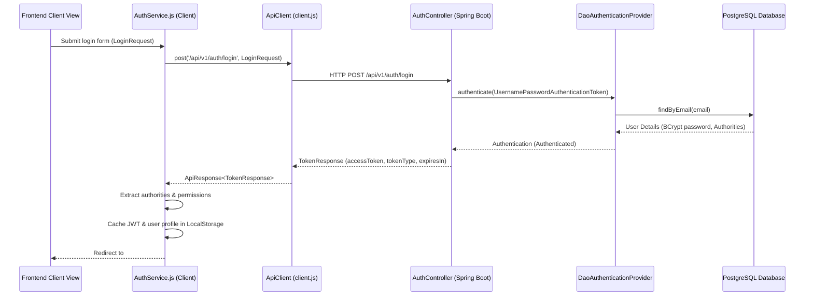

# Authentication Sequence Flow

This document details the authentication and credentials verification sequence for the PLUS33 ERP client.

## Sequential Authentication Sequence

## Session Recovery & Interception

1.  **Anti-Flicker Bootstrapper:** On page load, `index.html` matches the cached token in `LocalStorage`.
2.  **Bearer Interception:** Every outgoing request through `ApiClient` gets decorated with the `Authorization: Bearer <JWT>` header.
3.  **Authentication Expiry Handling:** If the backend returns a `401 Unauthorized` response code, `ApiClient` triggers a session expired event, clearing the cached token and redirecting the page to `#login`.
